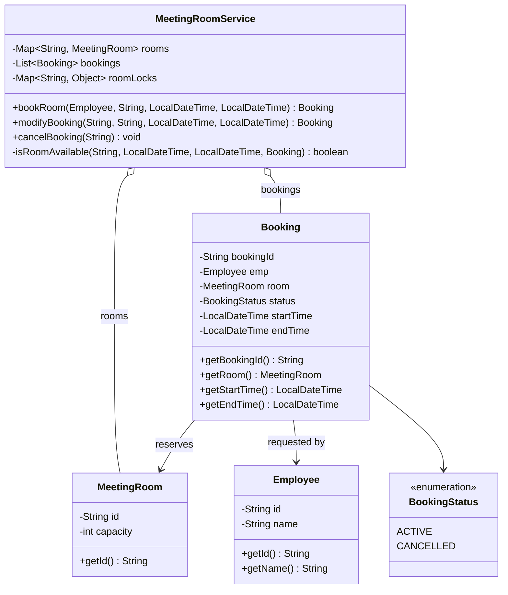
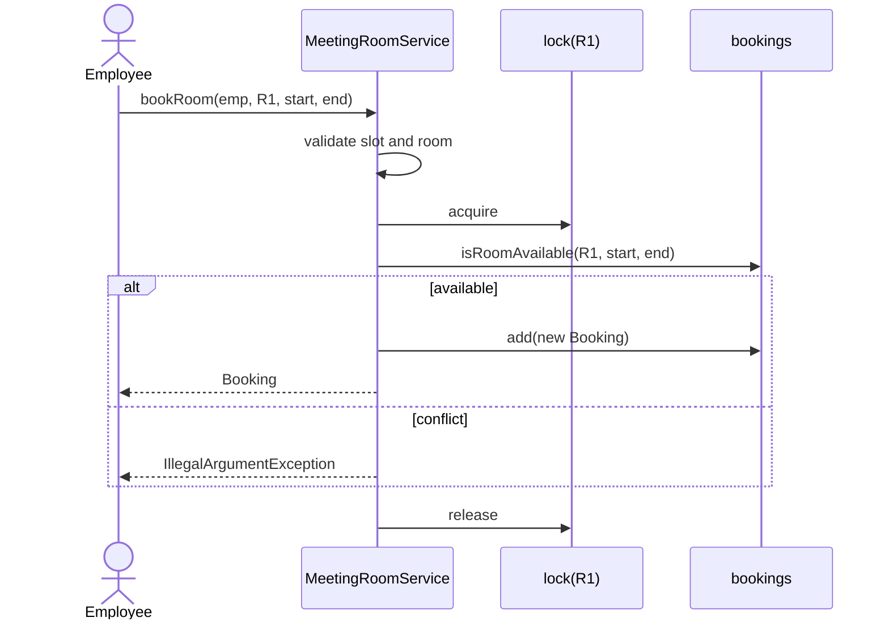

# Meeting Room Booking — Low-Level Design

The `lld.MeetingRoom` package is an in-memory meeting-room scheduler. It focuses on the important interview concern: preserving the invariant that one room cannot have two active bookings whose time intervals overlap, even when operations for the same room race.

## 1. Problem Statement

Design a service that lets employees book, modify, and cancel meeting-room reservations. A room may host only one meeting at any instant. Requests for different rooms should not unnecessarily serialize, and moving a booking between rooms must not introduce either a conflict or a deadlock.

## 2. Requirements

Implemented requirements:

- Create a booking for an existing room and a valid 15–240 minute time slot.
- Reject overlapping bookings for the same room; adjacent bookings are allowed.
- Modify a booking's room and/or time slot.
- Cancel a booking by ID.
- Protect booking decisions with room-level locks.

Out of scope in this implementation: authentication/authorization, attendee count and room-capacity enforcement, recurring events, persistence, search, time zones, notifications, and distributed coordination.

## 3. Domain Model

| Type | Meaning |
| --- | --- |
| `Employee` | Immutable requester identified by employee ID and name. |
| `MeetingRoom` | Immutable room identity plus stored capacity. |
| `Booking` | A generated booking ID, employee, mutable room, and mutable time interval. |
| `BookingStatus` | Defines the booking lifecycle states `ACTIVE` and `CANCELLED`. |
| `MeetingRoomService` | Application service holding rooms, bookings, and the per-room lock registry. |

The central invariant is: for all stored bookings in a room, their half-open intervals `[start, end)` do not overlap.

## 4. Class Responsibilities

`MeetingRoomService` validates requests, finds rooms/bookings, checks availability, and makes mutation atomic with respect to the affected room(s). `Booking` owns construction-time time-slot validation and carries reservation state. `MeetingRoom` and `Employee` are small identity/value-like domain objects. `MeetingRoomClient` is a demonstration, not a UI or API boundary.

## 5. Class Diagram (Mermaid UML)



## 6. Important Design Decisions

- A `Booking` references a room instead of a room owning a mutable calendar. This keeps booking identity stable while a reservation moves rooms.
- Availability is derived by scanning bookings, so there is one source of truth rather than a booking list in both service and room.
- Locks are keyed by room ID. The conflict invariant is per room, so a global lock would provide correctness but discard useful concurrency.
- A cross-room modification locks both old and new rooms because it removes capacity from one logical calendar while adding it to another.
- The code uses `LocalDateTime` for a simple local scheduler. A real cross-region product should use `Instant` plus a meeting location/time-zone policy.

## 7. SOLID / OOP Analysis

This is a deliberately compact model, not a textbook-perfect SOLID design. `Employee`, `MeetingRoom`, and `Booking` have cohesive data responsibilities. `MeetingRoomService`, however, combines repository-like storage, validation, scheduling policy, and synchronization; that is acceptable for an in-memory interview version but weakens SRP as the system grows.

There are no interfaces around storage, clock/ID generation, or scheduling rules, so DIP and OCP are limited. Extracting `BookingRepository`, `RoomRepository`, `AvailabilityPolicy`, and a lock/transaction abstraction would make alternate storage, policies, and tests easier. `MeetingRoom` is immutable, while `Booking` is intentionally mutable for modification. Cancellation is a soft state transition; a production version would add audit metadata if historical reporting is required.

## 8. Booking Flow

1. Validate the requested time slot (non-null, start before end, 15–240 minutes) and room ID.
2. Resolve the room and its lock.
3. Acquire that room's lock.
4. Scan existing bookings for an overlap in that room.
5. If none exists, create and add the booking; otherwise reject the request.



## 9. Modification Flow

For an in-room edit, the service locks that one room and excludes the booking being edited from its overlap check. For a room move, it locks both rooms in a global order, tests the destination, then updates the existing booking's room and times as one critical section.

```mermaid
sequenceDiagram
    actor Client
    participant S as MeetingRoomService
    participant L1 as lock(R1)
    participant L2 as lock(R2)
    participant B as bookings
    Client->>S: modifyBooking(id, R2, start, end)
    S->>S: validate slot; find current R1 booking
    S->>L1: acquire first (R1 < R2)
    S->>L2: acquire second
    S->>B: check R2 availability
    alt available
        S->>B: update room and times
        S-->>Client: modified Booking
    else conflict
        S-->>Client: IllegalArgumentException
    end
    S->>L2: release
    S->>L1: release
```

## 10. Cancellation Flow

The service finds the booking, obtains the lock for its room, then changes its status to `CANCELLED`. Cancelled bookings stay in the in-memory list as history, but availability checks ignore them.

## 11. Concurrency Model

The intended model is a monitor per room: every operation that decides or mutates availability for `R1` synchronizes on `lock(R1)`. Thus competing bookings for one room serialize, while independent single-room operations can proceed separately. A cross-room move locks both affected monitors.

This is only partially thread-safe as implemented. `bookings` is caller-supplied and may be an `ArrayList`; it is scanned outside a global collection lock during lookups and may be modified under a different room lock. Concurrent structural mutation can cause unsafe iteration or visibility problems. Also, cancellation looks up a booking before locking its room, and a simultaneous move can make that reference stale. The room locks protect the scheduling decision, but they do not make the shared list a fully safe concurrent repository.

## 12. Why Lock Per Room?

The invariant is local: only bookings for the same room compete. Locking each room separately lets a booking for R1 proceed independently of one for R2. A single service-wide lock is simpler but turns unrelated traffic into contention; no lock would allow two threads to both observe R1 as free and both insert a conflicting booking.

## 13. Why Does R1 → R2 Modification Need Two Locks?

A move changes the booking's membership in two room calendars. Locking only R2 protects the destination check, but a concurrent cancellation or another move can still act on the booking as an R1 reservation. Locking R1 and R2 establishes an atomic boundary around the transition: observers of either affected room cannot make a conflicting decision midway through it.

## 14. How Deadlock Can Occur

Without a common rule, thread A moving R1 to R2 could hold R1 and wait for R2, while thread B moving R2 to R1 holds R2 and waits for R1. Neither can proceed. This circular wait is the classic two-lock deadlock.

## 15. Why Locks Are Acquired Lexicographically

The service compares room IDs and always takes the lower lexical ID first. For R1/R2, every move takes R1 then R2, regardless of direction. A universal total order eliminates the circular-wait condition, so the particular ordering does not matter; consistency does. Production code should centralize this rule and define ID normalization/case semantics rather than relying on ad hoc strings.

## 16. Booking Overlap Logic

The test is:

```java
start.isBefore(existingEnd) && end.isAfter(existingStart)
```

It models half-open intervals `[start, end)`. `10:00–11:00` and `11:00–12:00` do not overlap because the new start is not before the existing end. Exact duplicates, containment, and partial intersections all overlap. Validating `start < end` is essential; otherwise malformed intervals make this predicate misleading. The service now validates slots before both booking and modification.

## 17. Thread-Safety Considerations

The design correctly identifies the critical business operation: *check availability and write the result must be under the same affected-room lock*. Do not split those actions across lock boundaries.

For a robust in-process implementation, own the collections internally, use a concurrency-safe booking index, and coordinate booking lookup/state transitions with a short service-level or booking-level protocol. A simple correct baseline is one global read/write lock; a scalable design can use a concurrent `bookingId → Booking` map plus per-room calendars and carefully ordered room locks. Mutable `Booking` fields should only be read/written through that protocol, or be immutable versions replaced atomically.

## 18. Complexity Analysis

With `N` total bookings, the current list scan is `O(N)` time for book, modify, or availability check; cancellation and booking lookup are also `O(N)`. Space is `O(R + N)` for `R` locks/rooms and `N` bookings. Lock acquisition is `O(1)` (one or two monitors). An indexed calendar per room can reduce conflict lookup to roughly `O(log B_r)` for `B_r` bookings in the room, depending on the data structure and query needs.

## 19. Edge Cases

- Unknown, null, or blank room IDs and booking IDs are rejected.
- Null times, zero/negative duration, and durations outside 15–240 minutes are rejected.
- Back-to-back reservations are valid.
- Moving within the same room excludes the booking itself before checking conflicts.
- Moving to another room does not need to exclude the source booking because it belongs to a different room at check time.
- Booking IDs are UUIDs, but comparisons are case-insensitive; UUID IDs are conventionally case-insensitive, though canonicalizing at the boundary would be clearer.
- Capacity exists but is not enforced; no attendee count is modelled.
- No past-time rule, rounding policy, recurring schedule, or time-zone/DST policy exists.

## 20. Interview Intuition — How to Derive This Design

### How to Derive This Design in an Interview

Start from invariants, not classes. Say: “A room cannot have overlapping active reservations, and an edit must leave all affected rooms valid.” This immediately identifies the aggregate being protected—the room calendar—and the operation that must be atomic—availability check plus write.

Then narrow the model. The nouns are `Employee`, `MeetingRoom`, and `Booking`; the service owns the commands because a command crosses these objects and the booking collection. Choose an interval representation and state that adjacent meetings must work, which leads to half-open interval logic. Ask whether changes can move rooms. If yes, identify that a move touches two calendars, hence two locks and a lock-order rule. Only after correctness is clear, discuss indexes, persistence, and distributed locking as scale-up concerns.

This reasoning framework works even if you choose different classes: every decision is traceable to an invariant or a stated product requirement rather than “because this is the usual design.”

## 21. Step-by-Step Reasoning From Requirements → Design

1. “Prevent double booking” → represent a booking with room, start, and end.
2. “Adjacent meetings should work” → use `[start, end)` and the strict overlap predicate.
3. “Book and check can race” → put validation, conflict check, and insertion in one critical section.
4. “Unrelated rooms should scale” → scope that critical section to one room rather than the whole service.
5. “Modify may move rooms” → treat it as a two-calendar transaction.
6. “Two locks can deadlock” → impose one deterministic order for every multi-room operation.
7. “Need audit, recovery, and multiple instances” → move beyond this in-memory model to durable transactional storage.

## 22. Common Mistakes / Failed Approaches

- Checking availability before acquiring the lock: two requests can both see an empty slot.
- Locking a new room but not the old room during a move: the state transition is not atomic across calendars.
- Acquiring source then destination based on request direction: opposite moves can deadlock.
- Treating `end == existingStart` as an overlap: it prevents valid back-to-back meetings.
- Updating the booking before confirming destination availability: a failed request can corrupt the source reservation.
- Using a shared `ArrayList` as if per-room monitors make every list operation safe: they do not.

## 23. Interview Follow-up Questions and Strong Answers

**How would you find a free room?** Add a room-level calendar/index and query each eligible room; filter by capacity, equipment, location, and policy before selecting. The current service has no such search requirement.

**Why not use `synchronized` on the service?** It is a correct first version, but it serializes requests for independent rooms. Per-room locks match the conflict domain.

**How do you make this multi-instance safe?** Put the invariant in a shared transactional store. For example, use a database transaction with an exclusion/range constraint where supported, or a transactional calendar table with suitable locking/version checks. JVM monitors do not coordinate separate processes.

**Would you use optimistic locking?** It can work when collisions are rare: read versioned availability, attempt a conditional write, and retry on conflict. The database must still enforce non-overlap.

**How do you support recurrence?** Store a recurrence rule and expand/materialize occurrences within a planning horizon; check every generated occurrence and define exception/cancellation behavior.

## 24. Possible Future Improvements

- Replace external mutable collections with repository interfaces and safe internal storage.
- Use `Map<String, Booking>` plus per-room ordered interval indexes.
- Add cancellation audit metadata, such as cancellation time and reason, if historical reporting is required.
- Enforce capacity and equipment requirements; expose `getCapacity()` or model suitability in a search policy.
- Add ownership/authorization, idempotency keys, validation messages, clock injection, and automated concurrent tests.
- Use `Instant`/`ZoneId`, persistence, transactions, observability, and retries for a production/distributed deployment.

## Running the Example

Run `MeetingRoomClient` from the IDE, or compile with Maven:

```bash
mvn test
```

There are currently no automated tests; the client demonstrates a successful booking, conflict rejection, back-to-back booking, cross-room modification, and cancellation.
