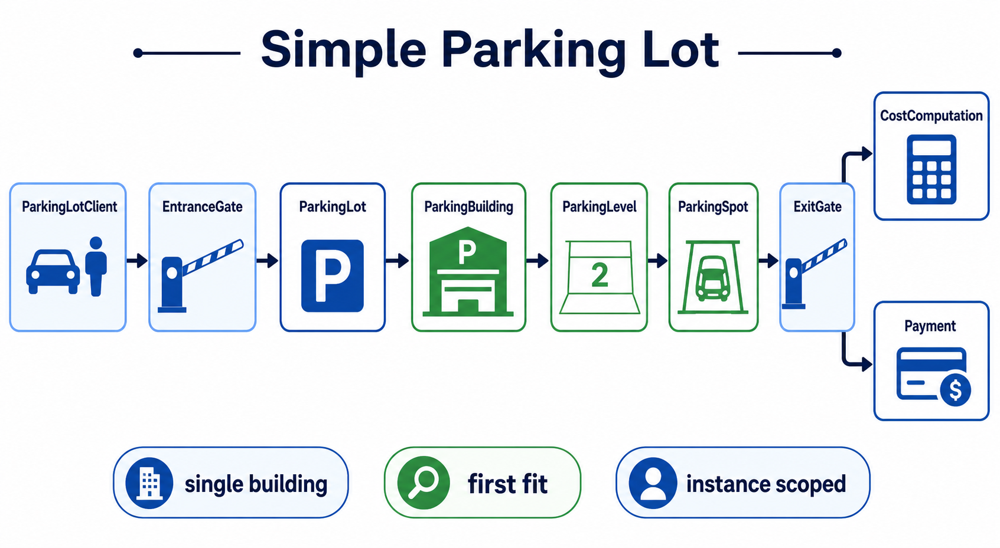

# Simple Parking Lot

This package is the deliberately small version of the parking-lot problem. It models one building, ordered levels, first-fit allocation, immutable tickets, a replaceable fee policy, and a payment boundary.

## Design

```text
ParkingLotClient
  -> EntranceGate -> ParkingLot -> ParkingBuilding -> ParkingLevel -> ParkingSpot
  -> ExitGate    -> ParkingLot -> CostComputation -> Payment
```

`ParkingLot` is an ordinary instance, not a Singleton. That makes tests independent and allows multiple facilities in one JVM. `ParkingSpot` owns its occupancy invariant, while `ParkingBuilding` owns allocation across levels.

## Notes



The package intentionally avoids the more advanced concerns in `parking_lot2`: no multiple payment gateways, no ticket status machine, no event pricing, no global registry, and no concurrent floor inventory.

## Flow

1. `EntranceGate` delegates a vehicle to `ParkingLot.enter`.
2. The building asks each level for the first compatible free spot.
3. A ticket records the vehicle, level, spot, and injected clock time.
4. `ExitGate` asks the lot to calculate the fee, collect payment, release the spot, and remove the active ticket.

Run it with:

```powershell
java -cp target/parking-simple-classes lld.parking_lot.ParkingLotClient
```
