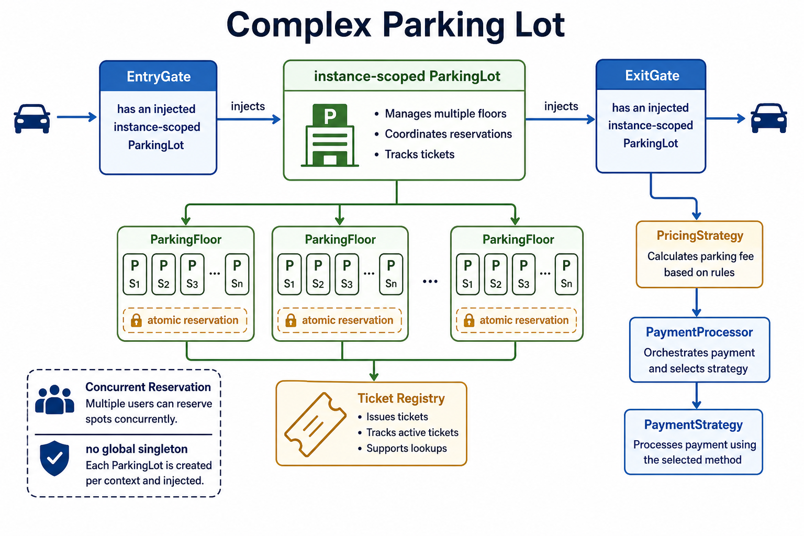
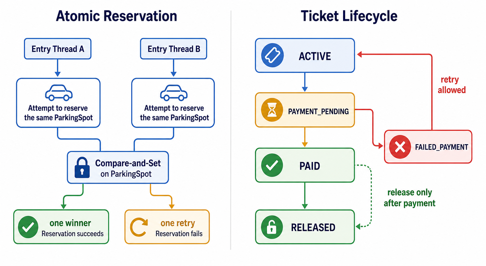

# Complex Parking Lot

This package is the richer version of the parking-lot problem. It models multiple floors, concurrent spot reservation, immutable vehicle identity, ticket payment state, injectable pricing and payment policies, and explicit entry/exit gate dependencies.

## Design

```text
Main
 |-- EntryGate -> ParkingLot -> ParkingFloor -> ParkingSpot (AtomicReference)
 `-- ExitGate  -> ParkingLot -> PricingStrategy
                         `----> PaymentProcessor -> PaymentStrategy
```

`ParkingLot` is instance-scoped. There is no global Singleton because a production service may host multiple facilities, tenants, or test fixtures in the same JVM.

## Notes





## Important decisions

- `ParkingSpot.tryReserve` uses compare-and-set, so concurrent entry requests cannot reserve the same bay.
- `Ticket` owns payment lifecycle state and rejects a second terminal transition.
- `ParkingLot.checkout` is serialized because payment and physical release form one business workflow.
- Payment and pricing are strategies selected by factories at the application boundary.
- Gate objects receive the lot through construction; they do not reach into global state.
- Date parsing uses an explicit English locale so behavior does not depend on the host machine.

## Flow

1. A vehicle is created by `VehicleFactory`.
2. `EntryGate` asks the lot to reserve a compatible spot on the first available floor.
3. The lot creates a ticket only after the atomic reservation succeeds.
4. `ExitGate` calculates the price, selects a payment strategy, and records success/failure.
5. Only successful payment releases the exact spot and removes the ticket from the active registry.

Run it with:

```powershell
java -cp target/parking-complex-classes lld.parking_lot2.Main
```

## Simple versus complex

| Concern | `parking_lot` | `parking_lot2` |
|---|---|---|
| Allocation | Ordered first-fit | Concurrent CAS reservation |
| State scope | One injected lot instance | One injected lot instance with active registry |
| Pricing | Flat fee strategy | Time/event strategies |
| Payment | Simple payment interface | Factory-selected payment strategies and ticket status |
| Ticket | Immutable receipt | Identity plus payment lifecycle |
| Goal | Learn core object collaboration | Explore production-oriented boundaries and concurrency |
